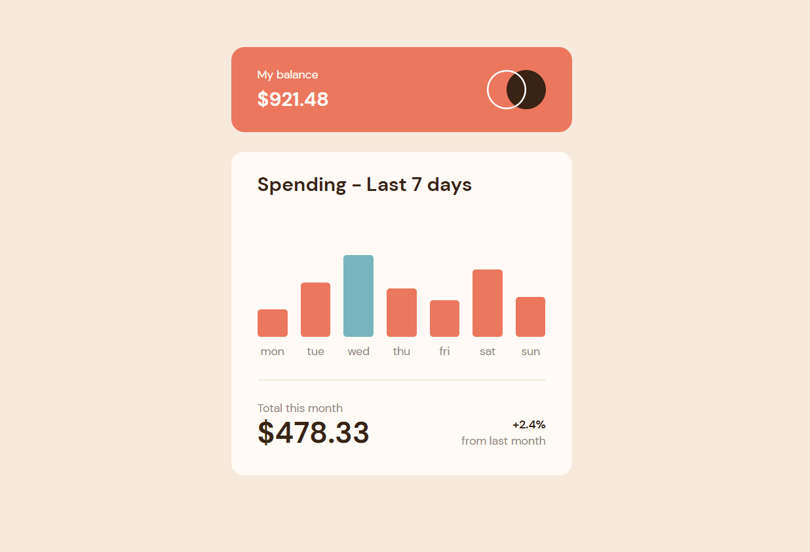

# Frontend Mentor - Expenses Chart Component Solution

This is a solution to the Expenses chart component challenge on [Frontend Mentor](https://www.frontendmentor.io/challenges/expenses-chart-component-e7yJBUdjwt).

## The Challenge

Users should be able to:

- View the bar chart and hover over the individual bars to see the correct amounts for each day
- See the current day’s bar highlighted in a different colour to the other bars
- View the optimal layout for the content depending on their device’s screen size
- See hover states for all interactive elements on the page
- **Bonus**: Use the JSON data file provided to dynamically size the bars on the chart

## Screenshot

## Links
Live Demo: [Click Here](https://my-expenses-chart-component.netlify.app/)

## Built with
- [React](https://reactjs.org/) - JS library
- [Tailwind CSS](https://tailwindcss.com/) - For styles

## License
MIT